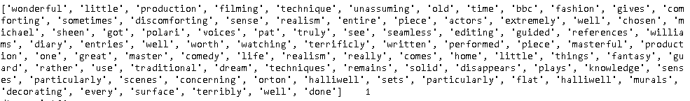
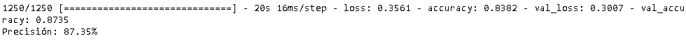
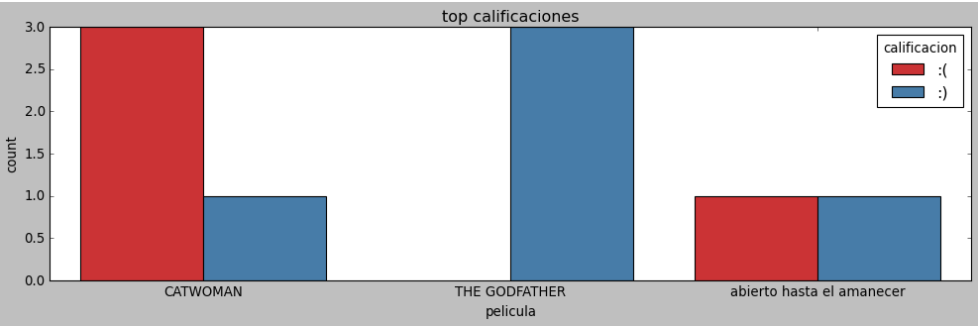
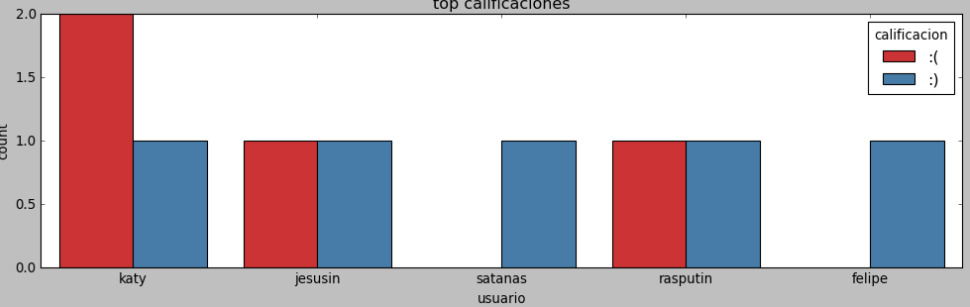

# ProyectoFinal-ForoCinefiloDelSentimiento

## OBJETIVO DEL PROYECTO

He creado una base de datos en mongo db a través de una **API** usando Flask (python), en donde se podrá crear un usuario, una película a comentar, y se podrán añadir reseñas sobre esas peliculas que se encuentren en la base de datos. Finalmente, tras crear una reseña, de devolverá del servidor el sentimiento de ésta, es decir, si es una reseña positiva o negativa. Para ello, mediante uso del **machine learning**, he entrenado una red neuronal capaz de sacar con buena precisión, una calificación binaria, donde si los valores son superiores a 0.5, será una reseña :) ,por el contrario, si el valor es menor a 0.5 sera una reseña :(

## FASES

### LIMPIEZA DATASET

He partido de un dataset que contiene 50000 reseñas de películas de idbm, calificándolas como positivas o negativas.
Para entrenar el modelo de red neuronal, he tenido que hacer una buena limpieza de todas las reseñas para dejarlas lo más depuradas posibles para que sea más facil la tarea de predicción. Esto implica:

-Eliminar las etiquetas HTML o de otro lenguaje de Web que pudiera haber.
-Eliminar caracteres o palabras irrelevantes (preposiciones, signos de puntuación, espacios en blanco...) La libreria **NLTK** ya cuenta con su propia lista de palabras irrelevantes y que he utilizado para sacarlas de las reseñas.

Al final, nos hemos quedado con una lista de palabras únicamente que servirán para entrenar nuestro modelo de manera más eficiente.

RESEÑA SUCIA

RESEÑA DESPUES DEL PREPROCESING

Por ultimo, hemos cambiado las etiquetas positivo y negativo por 1 y 0.

### MODELO RED NEURONAL SIMPLE MULTICAPA

Elegí este modelo de red neuronal que viene bien para casos de **PNL** con clasificación binaria, donde he limitado el vocabulario a 5000 palabras, que serán las más frecuentes de todo nuestro dataset ya limpio para entrenar.
Acoté un máximo de 100 palabras por reseña, donde si faltaban palabras se rellenaban con ceros, aunque evidentemente, el modelo cuantas más palabras registre mejor para las predicciones. 
Convertí a numeros las palabras del X de entrenamiento y del X de prueba para poder hacer las predicciones.
Finalmente obtuve una precision casi del 90% u guarde el modelo para meterlo posteriormente en la **API**

### API 

ENDPOINTS

**METODO POST**

**/usuario**  
campos = "nombre" y "contraseña"
--> te devuelve el id que usarás para crear una pelicula para comentar o una reseña sobre una pelicula en particular

**/pelicula**

campos = "titulo" y "token" --> el token es el id que te proporciona la **API** y con el que se podrá crear un campo de película para luego que pueda cualquier usuario hacer  reseñas sobre ella

**/reseña**

campos = "usuario", "titulo", "reseña" --> habrá que introducir el id o token del usuario y el id de la pelicula sobre la que se quiera hacer la reseña.
Si la se ha introducido un id de usuario, un id de pelicula y una reseña nos devolverá un JSON con la prediccion del modelo siendo :) positiva o :( negativa, la propia reseña, y el título de la pelicula en cuestión.

**METODO GET**

**/pelicula/nombredepelicula**

Se introduce el nombre de la pelicula que quieras, y te saca el id para hacer la posterior reseña

**/usuario/nombreusuario**

Se introduce el nombre del usuario y te devuelve un JSON con todas sus reseñas, el nombre de las películas que ha comentado, y la calificación que ha tenido en cada una de ellas.

**/repeli/nombrepelicula**

Devuelve todas las reseñas de esa película junto a los usuarios que han escrito esas críticas, así como sus calificaciones :) o :(

**/reseñas**

Te saca todas las reseñas de la base de datos, con sus calificaciones y con el usuario al que pertenecen, así como por supuesto el título de las películas criticadas.

Toda esta información se almacena en una base de datos de mongo que está conectada a mi **API**

### GRAFICANDO LAS RESEÑAS

Haciendo llamadas a mi **API** desde un jupiter notebook pude sacar todas las reseñas, con sus calificaciones, y las películas y usuarios a los que pertenecen.
Después convertí a dataframe los resultados para graficar que películas son más valoradas que otras, y vemos que, por ejemplo, el padrino no tiene ninguna reseña negativa, y que, ¡catwoman se lleva la palma en peor película!
Obviamente es una API de prueba pero si tuvieramos muchísimos datos se podría hacer una buena media para ver cual es mejor y cual peor.

Lo mismo para los usuarios, cuales son mas "criticones", y cuales no tanto.

### HERRAMIENTAS

Las  principales herramientas que he utilizado

-Python

-Flask para crear la API

-Mongo Db para la base de datos

-la página de rottentomatoes para coger de ahí la reseñas para nuestra base de datos
https://www.rottentomatoes.com

-POSTMAN para ir validando la API

-KERAS Y NTKL: Librerias para machine learning muy buenas para el análisis del sentimiento

-Seaborn y matplotlib para los gráficos

### CARPETAS

-API: Contiene un archivo con los endpoints, la programación defensiva que uso para corregir los errores que me salían en mi API, otro donde creo la aplicación y la conecto a mi base de datos de mongo, y otro archivo donde guardo las funciones que limpiarán y harán las predicciones de las reseñas. Aparecen dos archivos aparte, que es el modelo y sus pesos que cargo en la API para predecir.

-Datasets

